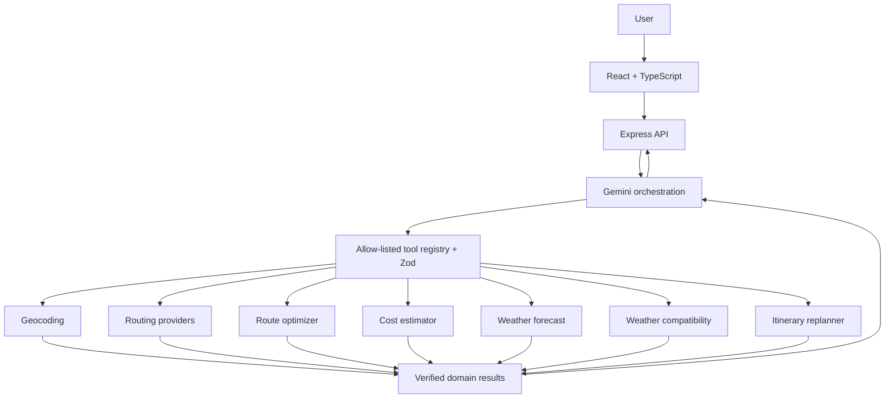

# BookOnce

BookOnce is a tool-assisted AI travel planner that combines Gemini intent understanding with deterministic routing, multi-objective optimization, cost estimation, weather-aware replanning, and explainable recommendations.

It is a React/TypeScript application backed by an Express API. The agent can research and compare a journey, but it does not purchase flights, trains, or hotels and should not be treated as a live fare source.

## Implemented systems

- Tool-calling travel agent with a strict allow-list, Zod argument validation, and a bounded loop.
- Structured Gemini journey responses validated before the UI consumes them.
- Backend geocoding and routing through Nominatim and OpenRouteService, with OSRM fallback routing.
- Genuine provider route alternatives when available.
- Deterministic multi-objective route optimization and explainable rankings.
- Natural-language route preference extraction for fastest, cheapest, balanced, comfort, constraints, and walking sensitivity.
- Deterministic INR travel-cost estimates.
- Open-Meteo forecasts, deterministic activity compatibility, and itinerary replanning.
- React chat UI with visible tool progress and safe server error handling.

## Architecture



Gemini chooses a declared capability and supplies arguments. The registry rejects unknown tools and invalid arguments. A deterministic/provider-backed service executes the call, and Gemini explains the sanitized result. The loop is limited to 6 rounds and 12 calls. Internal reasoning and chain-of-thought are not exposed.

### What AI does vs. what code does

Gemini handles intent understanding, tool selection, and conversational explanation. BookOnce code owns coordinates, provider route distance/duration, route ranking, cost estimates, weather facts, compatibility thresholds, and replanning constraints. Tool output remains the authoritative structured data even if a generated explanation is imperfect.

The eight agent tools are `geocode_location`, `get_route_options`, `get_weather_forecast`, `interpret_route_preferences`, `optimize_routes`, `estimate_route_cost`, `evaluate_weather_compatibility`, and `propose_weather_replan`.

## Deterministic planning details

### Route optimizer

For each eligible route, BookOnce min-max normalizes known time, cost, walking, and transfer values. It minimizes:

`normalizedTime × timeWeight + normalizedCost × costWeight + normalizedWalking × walkingWeight + normalizedTransfers × transfersWeight`

Comfort contributes when supplied. Hard constraints remove ineligible candidates. A missing metric does not receive an invented value; it is omitted from that metric's contribution. Ties resolve by duration and then stable route ID, so identical inputs produce identical rankings.

### Cost estimates

Costs are versioned BookOnce heuristics, not live or provider-guaranteed fares. Demo assumptions are centralized, denominated in INR, and cover walking, private car, taxi, auto, and bike-taxi-style travel. Always verify an actual fare with a provider before purchase.

### Weather and replanning

Open-Meteo supplies forecast facts. BookOnce applies explicit planning thresholds for rain, heat, and wind; those compatibility results are heuristics. Replanning is deterministic, moves only compatible flexible activities on the same day, and never automatically moves fixed transport or fixed events.

## Local development

Requires Node.js 20+.

```bash
npm ci
copy .env.example .env
npm run server
```

In another terminal:

```bash
npm run dev
```

The frontend runs on Vite's local URL and proxies `/api` to the backend on port 3001. Set the server-only `GEMINI_API_KEY` in `.env` for Gemini features. Open-Meteo and Nominatim need no key; `OPENROUTE_API_KEY` is optional and server-only.

## Verification

```bash
npm run typecheck
npm run lint
npm run format:check
npm test
npm run eval
npm run build
```

`npm run eval` is deterministic, makes no Gemini calls, covers 10 representative intent, constraint, safety, malformed-output, missing-data, cost, optimizer, and weather scenarios, and calculates its metrics from fixture checks.

## Security and environment boundaries

- `GEMINI_API_KEY`, `OPENROUTE_API_KEY`, and Gmail application credentials are server-only.
- Firebase browser configuration is public client configuration, not a private server secret; protect Firebase resources with Firebase security rules.
- The optional legacy Skyscanner/RapidAPI browser integration uses `VITE_*` values, so those values are public to browser users. Restrict them at the provider and do not use an unrestricted private credential.
- The browser never calls Gemini directly. API errors returned to clients omit internal details.

## Known limitations

- Routing modes and alternative quality depend on provider coverage and availability.
- Cost estimates are heuristics, not bookings or quotes.
- Forecast accuracy and horizon are determined by Open-Meteo.
- The repository includes booking UI and mock booking adapters for demonstration; it is not a production booking engine.
- Some legacy UI areas still have ESLint warnings and demo/fallback data. They are not represented here as live services.
- A production build may report a large main chunk because map, animation, and booking UI share dependencies; route-level lazy loading is already used, and deeper splitting is future optimization.

## Future work

Possible extensions include authenticated production booking providers, richer transit feeds, improved bundle splitting, and deployment hardening. These are not implemented features.
